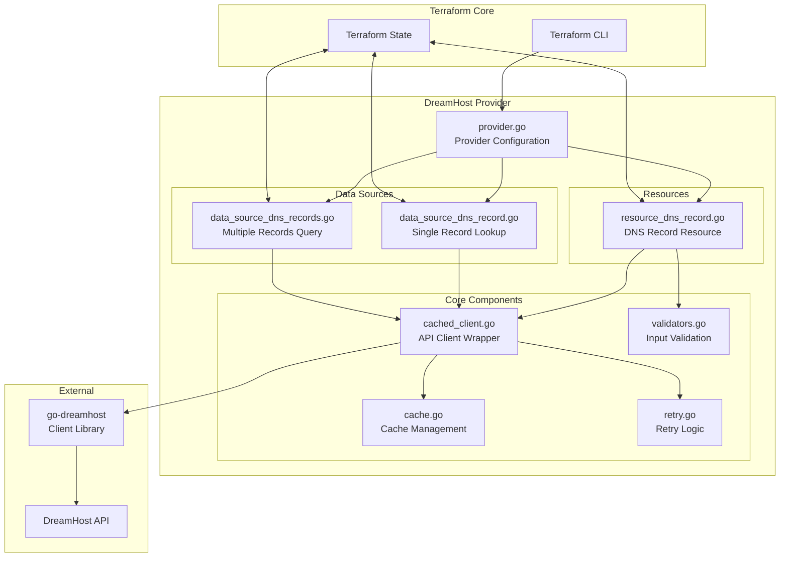
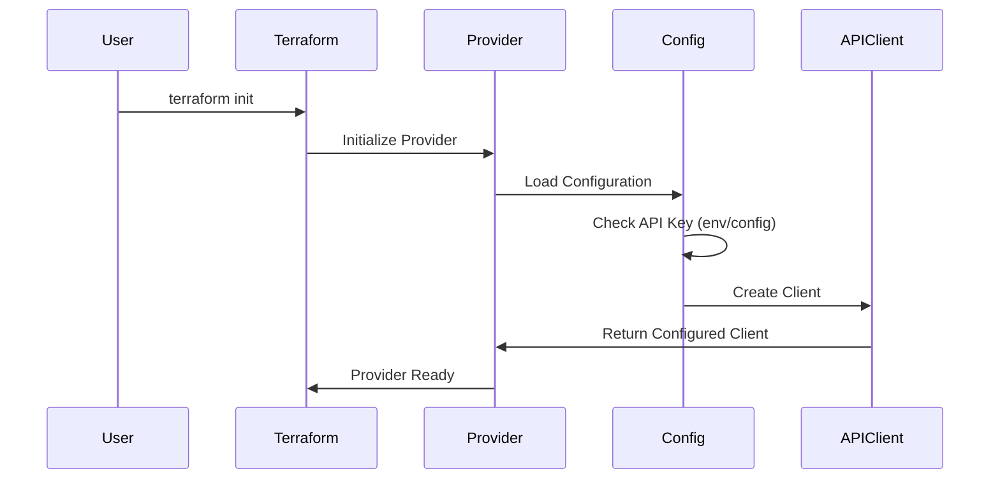
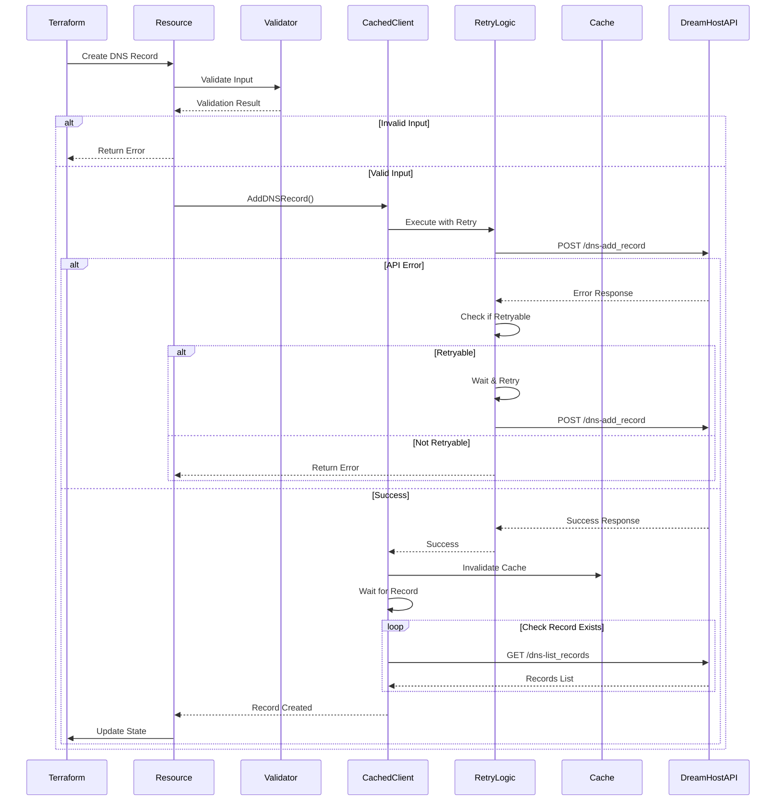
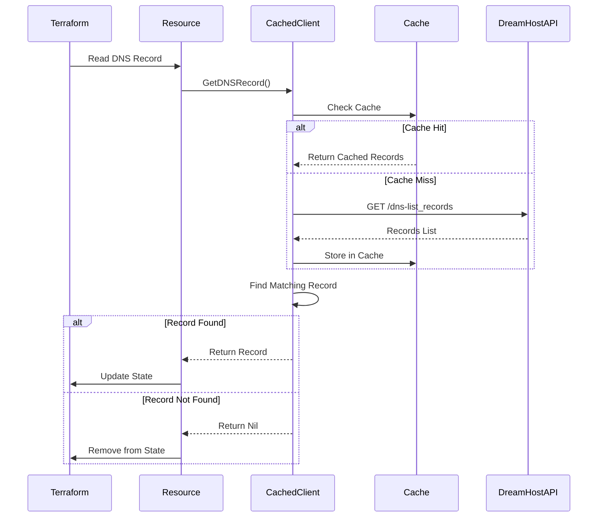
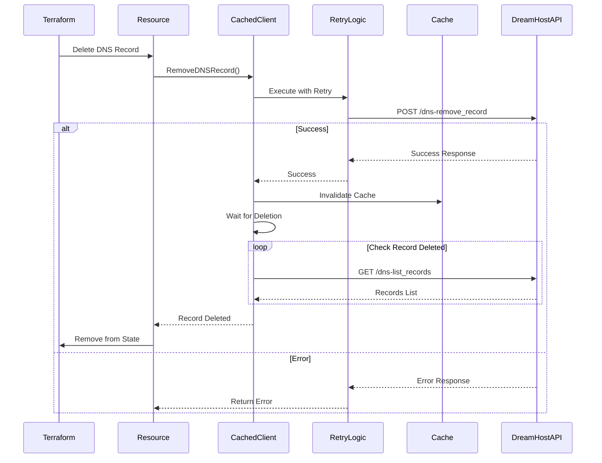
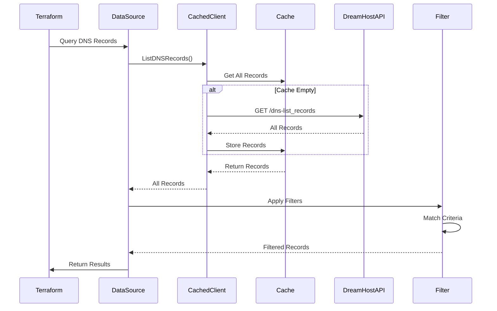
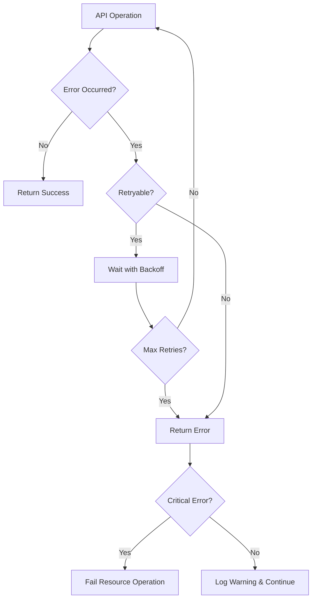
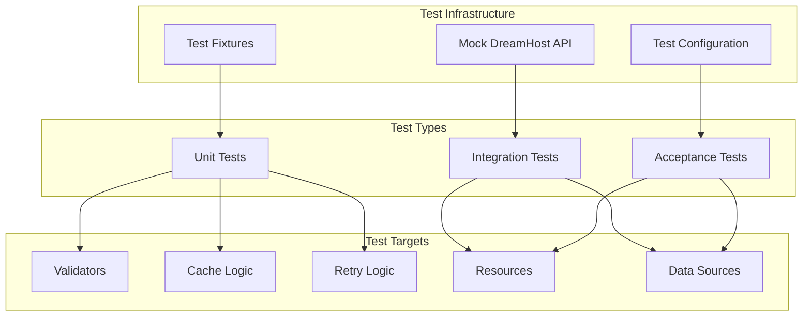

# DreamHost Terraform Provider Architecture

## Table of Contents
- [Overview](#overview)
- [Component Architecture](#component-architecture)
- [Data Flow](#data-flow)
- [Sequence Diagrams](#sequence-diagrams)
- [Module Descriptions](#module-descriptions)
- [Design Patterns](#design-patterns)

## Overview

The DreamHost Terraform Provider is built using the Terraform Plugin SDK v2 and follows HashiCorp's best practices for provider development. It interfaces with the DreamHost API to manage DNS records.

## Component Architecture

## Data Flow

### Provider Initialization Flow

### DNS Record Creation Flow

### DNS Record Read Flow

### DNS Record Deletion Flow

### Data Source Query Flow

## Module Descriptions

### Core Provider Module (`provider.go`)

**Responsibilities:**
- Provider configuration and initialization
- API key management
- Resource and data source registration
- Client instantiation

**Key Functions:**
- `Provider()`: Returns configured provider schema
- `providerConfigure()`: Initializes API client with credentials

### DNS Record Resource (`resource_dns_record.go`)

**Responsibilities:**
- CRUD operations for DNS records
- State management
- Import functionality
- Input validation coordination

**Key Functions:**
- `resourceDNSRecordCreate()`: Creates new DNS record
- `resourceDNSRecordRead()`: Reads existing record
- `resourceDNSRecordDelete()`: Removes DNS record
- `recordInputToID()`: Generates unique resource ID
- `idToRecordInput()`: Parses ID for import

### Data Sources

#### Single Record Lookup (`data_source_dns_record.go`)

**Responsibilities:**
- Query specific DNS record
- Handle ambiguous matches
- Populate computed fields

**Key Functions:**
- `dataSourceDNSRecordRead()`: Finds and returns single record

#### Multiple Records Query (`data_source_dns_records.go`)

**Responsibilities:**
- List all DNS records
- Apply filters
- Support partial matching

**Key Functions:**
- `dataSourceDNSRecordsRead()`: Returns filtered record list
- `filterDNSRecords()`: Applies filter criteria
- `matchesFilter()`: Evaluates individual record against filters

### Caching Layer

#### Cache Management (`cache.go`)

**Responsibilities:**
- Thread-safe record caching
- Cache invalidation
- Memory management

**Key Functions:**
- `GetRecords()`: Returns cached records or fetches new
- `Invalidate()`: Clears cache after modifications

#### Cached Client (`cached_client.go`)

**Responsibilities:**
- Wraps DreamHost API client
- Manages cache lifecycle
- Coordinates API calls

**Key Functions:**
- `AddDNSRecord()`: Adds record and invalidates cache
- `GetDNSRecord()`: Retrieves with cache support
- `RemoveDNSRecord()`: Removes and invalidates cache
- `ListDNSRecords()`: Lists all records

### Reliability Components

#### Retry Logic (`retry.go`)

**Responsibilities:**
- Retry transient failures
- Handle rate limiting
- Wait for eventual consistency

**Key Functions:**
- `retryOnError()`: Wraps operations with retry logic
- `isRetryableError()`: Determines retry eligibility
- `waitForDNSRecord()`: Polls until record appears
- `waitForDNSRecordDeletion()`: Polls until record removed

#### Validators (`validators.go`)

**Responsibilities:**
- DNS record type validation
- IP address validation
- Hostname validation
- Record-specific format validation

**Key Functions:**
- `ValidateDNSRecordName()`: Validates DNS names
- `ValidateIPv4Address()`: Validates IPv4 format
- `ValidateIPv6Address()`: Validates IPv6 format
- `ValidateMXRecord()`: Validates MX record format
- `ValidateSRVRecord()`: Validates SRV record format
- `ValidateDNSRecordValue()`: Type-specific validation

## Design Patterns

### 1. **Cached Wrapper Pattern**
The `cachedDreamhostClient` wraps the base API client to add caching capabilities transparently.

### 2. **Retry Pattern with Exponential Backoff**
All API operations use configurable retry logic to handle transient failures gracefully.

### 3. **Repository Pattern**
DNS records are accessed through a consistent interface regardless of cache state.

### 4. **Factory Pattern**
Provider configuration creates appropriate client instances based on configuration.

### 5. **Strategy Pattern**
Validators use different validation strategies based on DNS record type.

### 6. **Observer Pattern**
Cache invalidation occurs automatically when data modifications happen.

## Error Handling Strategy

## Performance Optimizations

1. **Intelligent Caching**: Reduces API calls by caching list operations
2. **Parallel Operations**: Data sources can query concurrently
3. **Lazy Loading**: Cache populated only when needed
4. **Automatic Invalidation**: Cache cleared on modifications
5. **Efficient Filtering**: In-memory filtering reduces API load

## Security Considerations

1. **API Key Protection**: Sensitive field, supports environment variables
2. **No Logging of Secrets**: Error messages sanitized
3. **Input Validation**: All inputs validated before API calls
4. **Secure Defaults**: No hardcoded credentials

## Future Architecture Considerations

### Potential Enhancements

1. **Distributed Caching**: Redis/Memcached for multi-instance deployments
2. **Batch Operations**: Bulk create/delete capabilities
3. **Webhook Support**: Real-time updates via webhooks
4. **Metrics Collection**: Prometheus metrics for monitoring
5. **Circuit Breaker**: Prevent cascade failures
6. **Rate Limit Management**: Adaptive rate limiting

### Scalability Path

## Dependencies

| Component | Version | Purpose |
|-----------|---------|---------|
| Terraform SDK | v2.26.1 | Provider framework |
| go-dreamhost | v0.1.1 | DreamHost API client |
| Go | 1.19+ | Runtime |

## Testing Architecture

---

This architecture ensures reliability, performance, and maintainability while providing a clear separation of concerns and extensibility for future enhancements.